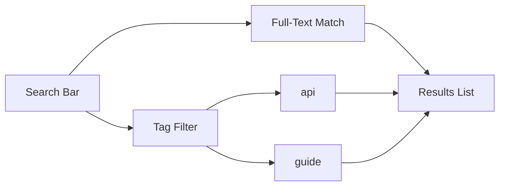

## Overview

Klutr provides a complete suite of tools for creating, managing, and sharing project documentation. You can build structured docs with markdown support, track changes over time, collaborate with teams, and find content quickly using search and tags. These features make it easy to maintain up-to-date documentation for any project.

<Callout kind="info">
  Start by creating your first document to explore these features hands-on.
</Callout>

## Key Features

<Columns cols={2}>
  <Card title="Document Creation" icon="file-text" href="#document-creation">
    Quickly create new pages with rich markdown editing.
  </Card>
  <Card title="Version History" icon="git-branch" href="#version-history">
    Track revisions and restore previous versions effortlessly.
  </Card>
  <Card title="Collaboration" icon="users" href="#collaboration">
    Manage permissions and work with your team securely.
  </Card>
  <Card title="Search & Tagging" icon="search" href="#search-tagging">
    Find and organize content with powerful search and tags.
  </Card>
</Columns>

## Document Creation

Create new documents in seconds. Navigate to your project space, click the `New Page` button, and start editing with Klutr's built-in markdown editor.

<Steps>
  <Step title="Create Page" icon="plus">
    Select your project and click `New Document`.
  </Step>
  <Step title="Add Content" icon="edit-3">
    Use the editor toolbar for headings, lists, and code blocks.
  </Step>
  <Step title="Publish" icon="upload">
    Save and publish to make it live for your team.
  </Step>
</Steps>

## Markdown Editing

Klutr supports full markdown with live preview. Write structured content using standard syntax.

<CodeGroup tabs="Markdown,Preview">
  ```markdown
  # Welcome to Klutr

  ## Quick Start

  - Install dependencies
  - Configure your project
  - Deploy to production

  ```javascript
  console.log("Hello, Klutr!");
  ```
  ```
  ```html
  <h1>Welcome to Klutr</h1>

  <h2>Quick Start</h2>

  <ul>
    <li>Install dependencies</li>
    <li>Configure your project</li>
    <li>Deploy to production</li>
  </ul>

  <pre><code class="language-javascript">console.log("Hello, Klutr!");</code></pre>
  ```
</CodeGroup>

## Version History

Every change is automatically saved with version history. View diffs, restore versions, or compare changes.

<Expandable title="View Version Diff" default-open="true">
  Access history via the page menu. Select two versions to see side-by-side changes:

  | Change | Author | Date       | Description          |
  |--------|--------|------------|----------------------|
  | Added intro | You   | 2024-10-15 | New welcome section |
  | Fixed links | Team  | 2024-10-14 | Corrected navigation|
</Expandable>

## Collaboration and Permissions

Invite team members and control access. Klutr offers role-based permissions for secure collaboration.

<Tabs>
  <Tab title="Admin" icon="shield">
    Full access: edit, delete, manage users.
  </Tab>
  <Tab title="Editor" icon="edit">
    Edit pages and manage versions.
  </Tab>
  <Tab title="Viewer" icon="eye">
    Read-only access to documentation.
  </Tab>
</Tabs>

<Callout kind="tip">
  Use workspace settings to invite users by email and assign roles.
</Callout>

## Search Functionality and Tagging

Quickly find documents with full-text search and tags. Add tags like `api`, `guide`, or `v1.0` during editing.



Organize large projects by applying multiple tags per page. Combine with search for precise results.

<Callout kind="success">
  Tags improve discoverability—use them consistently across your docs.
</Callout>