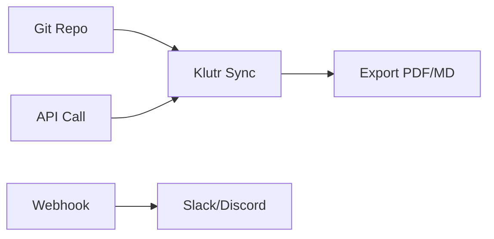

## Overview

Klutr integrates seamlessly with your existing toolchain. Connect Git repositories for automatic documentation syncing, use API endpoints for custom automation, set up webhooks for real-time notifications, and export docs to various formats. These integrations help you maintain up-to-date documentation without manual effort.

<Callout kind="tip">
Review your integration permissions before enabling features like Git syncing or webhooks to ensure secure access.
</Callout>

## Git Repository Syncing

Sync your documentation directly with Git repositories from GitHub, GitLab, or Bitbucket. Changes pushed to your repo automatically update Klutr docs.

<Steps>
  <Step title="Connect Repository" icon="git-branch">
    Navigate to the Integrations dashboard in Klutr. Select `Git Sync` and authorize your provider.

    ```bash
    # Example: Grant repo access via OAuth
    # Visit: https://dashboard.klutr.com/integrations/git
    ```
  </Step>
  <Step title="Configure Sync" icon="settings">
    Specify the branch (e.g., `main`) and sync direction (push/pull).

    <CodeGroup tabs="GitHub,GitLab">
    ````yaml
    # GitHub webhook config example
    repo: owner/my-docs-repo
    branch: main
    path: /docs
    ````
    ````yaml
    # GitLab project config
    project_id: 123456
    branch: main
    file_path: /project/docs
    ````
    </CodeGroup>
  </Step>
  <Step title="Test Sync" icon="play">
    Push a test commit and verify updates appear in Klutr within seconds.
  </Step>
</Steps>

## Custom Integrations via API

Build custom workflows using Klutr's REST API at `https://api.example.com/v1`. Authenticate with your API key.

<ParamField path="projectId" param-type="string" required="true">
  Your Klutr project identifier.
</ParamField>

<ParamField header="Authorization" param-type="string" required="true">
  Bearer `{YOUR_API_KEY}`.
</ParamField>

<Request tabs="JavaScript,cURL">
````javascript
const response = await fetch('https://api.example.com/v1/docs', {
  method: 'POST',
  headers: {
    'Authorization': 'Bearer YOUR_API_KEY',
    'Content-Type': 'application/json'
  },
  body: JSON.stringify({
    title: 'New Doc',
    content: '# Hello World'
  })
});
````
````bash
curl -X POST https://api.example.com/v1/docs \
  -H "Authorization: Bearer YOUR_API_KEY" \
  -H "Content-Type: application/json" \
  -d '{
    "title": "New Doc",
    "content": "# Hello World"
  }'
````
</Request>

<Response tabs="200,400">
```json
{
  "id": "doc_123",
  "title": "New Doc",
  "status": "created"
}
```

```json
{
  "error": "Invalid API key",
  "code": 401
}
```
</Response>

## Webhook Configurations

Set up webhooks to receive events like doc updates or project changes. Configure payloads for your notification service.

<Tabs>
  <Tab title="Slack" icon="message-circle">
    Create a Slack Incoming Webhook URL and add it in Klutr settings.

    ````javascript
    // Example Slack payload from Klutr webhook
    {
      "event": "doc.updated",
      "projectId": "proj_456",
      "url": "https://docs.klutr.com/project/doc-123"
    }
    ````

    <Callout kind="info">
      Test webhooks using Klutr's simulator before going live.
    </Callout>
  </Tab>
  <Tab title="Discord" icon="discuss">
    Use Discord webhooks for team channels.

    ````javascript
    // Discord payload structure
    {
      "content": "Klutr doc updated: https://docs.klutr.com/project/doc-123"
    }
    ````
  </Tab>
</Tabs>

## Exporting Documentation

Export your Klutr docs to PDF, Markdown, or HTML for sharing or archiving.

<Columns cols={2}>
  <Card title="PDF Export" icon="file-text" href="#">
    Generate print-ready PDFs with custom branding.
  </Card>
  <Card title="Markdown" icon="file" href="#">
    Download raw Markdown files for Git or other tools.
  </Card>
  <Card title="HTML" icon="globe" href="#">
    Static HTML export for hosting anywhere.
  </Card>
  <Card title="API Export" icon="code" href="#">
    Bulk export via API for automation.
  </Card>
</Columns>

<Expandable title="Advanced Export Options" default-open="false">
Use query parameters for filtered exports:

```bash
curl "https://api.example.com/v1/export?format=pdf&projectId=proj_456&Authorization=Bearer YOUR_API_KEY"
```
</Expandable>



<Callout kind="success">
Explore more in the [Quickstart](/quickstart) or [Authentication](/authentication) guides.
</Callout>